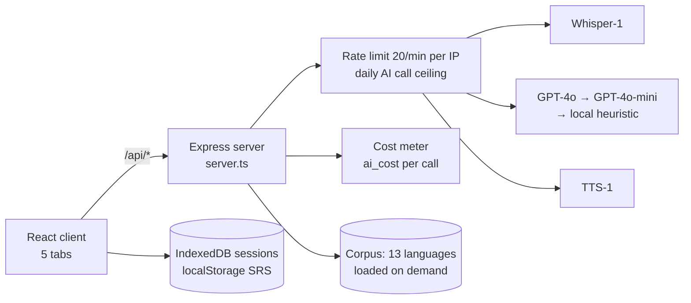

# Fluvio — System architecture

> Status: AUTHORED · Updated 2026-09-23 · Owner: Ossama Mokhtar

**A React 19 client and one Express 5 server, deployed as a single Vercel serverless function. The browser holds all learner state; the server holds the OpenAI key, the spend ceiling and the corpus.**

## Components

| Component | File | Role |
|---|---|---|
| Server | `server.ts` (re-exported by `src/api/index.ts` for Vercel) | 16 API routes, rate limiting, spend ceiling, input sanitising |
| Speech analysis | `/api/analyze-audio` | Whisper transcript → GPT-4o judgement → `measurement` declaration and `cost_estimate_usd` |
| Companion chat | `services/companionChatServer.ts` | Conversation partner with a model fallback chain |
| Scenarios | `services/scenarioService.ts` | 15 role-plays (EN/ES/FR), 5-dimension scoring; heuristic scores flagged `measured: false` |
| SRS | `services/srsService.ts` | Simplified FSRS scheduling in the browser |
| Corpus | `services/sentenceLibrary.ts`, `dataLoader.ts`, `data/sentences/` | Sentences, words, proverbs for 13 languages, lazily imported |
| Cost meter | `services/costMeter.ts` | Dated, env-overridable list prices; one log line per billable call |
| Sanitising | `services/sanitization.ts` | Free text cleaned before it reaches a prompt |

## Scale envelope

The rate limiter and spend ceiling are per serverless instance, so the effective ceiling is instances × budget. Moving both to a shared store is the first scaling step ([rate-limiting migration](rate-limiting-migration.md)).
