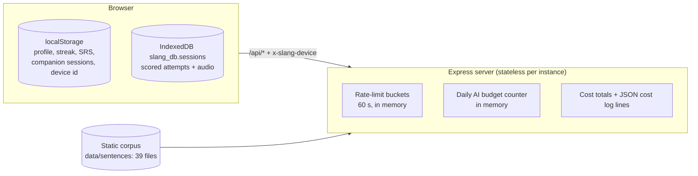

# 02 · Data model

> Status: AUTHORED · Updated 2026-09-23 · Owner: Ossama Mokhtar

Fluvio has **no database and no server-side user record**. Learner state lives in the browser; the server holds only short-lived counters in memory. That is a privacy choice for a voice product and a scaling constraint at the same time ([GAPS](GAPS.md)).

## Browser: localStorage

| Key | Shape | Purpose |
|---|---|---|
| `slang_profile` | `UserProfile`: `level`, `native_language`, `target_language`, `accent_reduction_goal?`, `motivation?`, `daily_goal_minutes?` | Onboarding answers; drives prompts and content |
| `slang_onboarded` | `"true"` | Skip onboarding |
| `slang_theme` | string | UI theme |
| `user_streak` | streak object | Daily practice streak |
| `slang_srs_state` | map of `SRSRecord`: `sentenceId`, `nextReview`, `interval`, `easeFactor`, `repetitions`, `lastReviewed`, `lastScore` | Spaced-repetition schedule (FSRS-style, `services/srsService.ts`) |
| `companion_<target_language>` | `CompanionSession` with message history | Conversation practice per language |
| `slang_device_id` | random 32-char token | Rate-limit identity sent as `x-slang-device` ([08](08-security-and-privacy.md)) |
| `linguaflow_profile`, `linguaflow_onboarded` | legacy | Read once and migrated to `slang_*` |

## Browser: IndexedDB `slang_db`, store `sessions` (key `id`)

`SessionRecord`: `id`, `timestamp`, `overall_score`, `pronunciation_score`, `intelligibility_score`, `phoneme_errors[]`, `target_phoneme?`, `full_analysis` (`AnalysisResponse`), `audioBlob?`, `annotatedTranscriptWords?`.

`AnalysisResponse` is the scored result of one utterance: summary, three scores, `confidence`, prioritised actions, a model phrase with IPA hint, drills, phoneme errors, prosody deviations, optional pitch contour and pronunciation guide, and `cost_estimate_usd` added by the server.

**The audio blob is the most sensitive item Fluvio holds, and it never leaves the browser after scoring.** Clearing site data deletes it.

## Server: in memory only

| State | Lifetime | Note |
|---|---|---|
| Rate-limit buckets keyed by device id, else IP | 60 s window | Per instance |
| AI call budget (`AI_CALL_BUDGET_PER_DAY`, default 2,000) | Day | Per instance, fails closed with `429` |
| Cost totals and one `ai_cost` JSON log line per billable call | Process lifetime; log lines go to platform logs | List-price estimate (`PRICES_AS_OF`), not an invoice |

## Static content

`data/sentences/`: 39 files, 9,689 unique entries after de-duplication, checked in CI by claim C-18 ([DATA-QUALITY](DATA-QUALITY.md)). Also `data/phonemes.ts`, `data/ipaReference.ts`, `data/scenarios.ts`, `data/library.ts`.

## Consequences

- No cross-device sync, no account recovery, no cohort analytics. Retention can't be measured server-side today.
- Per-instance counters mean the real global ceiling is instances × budget. Moving counters to Redis is the first spend-control item.
