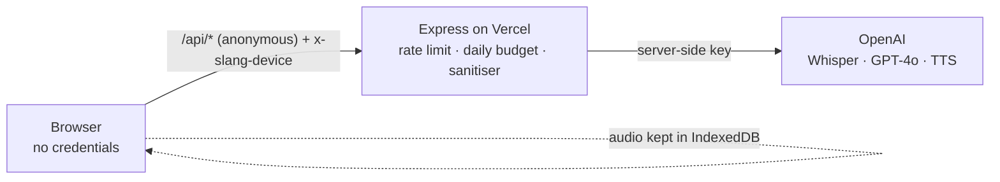

# 08 · Security and privacy

> Status: AUTHORED · Updated 2026-09-23 · Owner: Ossama Mokhtar

This is the architecture view. The control-by-control list, each tied to an executable check, is the root [SECURITY.md](../SECURITY.md). What happens to a recording, legal basis and user rights are in [PRIVACY.md](../PRIVACY.md).

## Trust boundaries

| Boundary | Threat | Control | Evidence |
|---|---|---|---|
| Browser → server | Budget abuse by anonymous callers | Per-device rate limit; daily AI ceiling that fails closed | Claims C-07, C-08, C-19 |
| Browser → server | Prompt injection through free text | `safeSentence` on companion and scenario messages | C-09 |
| Server → OpenAI | Key exposure | Key read from `process.env` on the server; nothing inlined in the client bundle | C-10 |
| Server | Oversize payloads | 4 MB body cap, under Vercel's 4.5 MB | C-12 |
| Browser storage | Voice data at rest | Stored only in the learner's browser; not on the server | Data model ([02](02-data-model.md)) |

## Privacy position

Voice recordings are personal data and treated as biometric-adjacent. They go to OpenAI for transcription and scoring and are not retained by Fluvio's server. GDPR applies today because EU users can reach the app.

## Open risks, ranked

1. **No authentication.** Spend is bounded, not attributable.
2. **Counters are per instance.** Global ceiling is instances × budget.
3. **No Content Security Policy.**
4. **No secret scanning in CI.**
5. **Model retirement.** Pinned model names can disappear without notice.

Each item has a plan in [SECURITY.md](../SECURITY.md#known-gaps--stated-not-hidden).
